# Network & Cybersecurity Homelab

Network, virtualization & cybersecurity homelab: DHCP, DNS, routing, VLAN segmentation, firewall, Active Directory, IDS/SIEM, built step by step from scratch.

## Summary

- [x] [Phase 0 — Setup](#phase-0--setup)
- [x] [Phase 1 — First virtual network](#phase-1--first-virtual-network)
- [x] [Phase 2 — Network servers (DHCP/DNS)](#phase-2--network-servers)
- [ ] [Phase 3 — Routing](#phase-3--routing)
- [ ] [Phase 4 — Firewall](#phase-4--firewall)
- [ ] [Phase 5 — Active Directory](#phase-5--active-directory)
- [ ] [Phase 6 — Cyber Blue Team (detection)](#phase-6--cyber-blue-team-detection)
- [ ] [Phase 7 — Cyber Red Team (attack)](#phase-7--cyber-red-team-attack)
- [ ] [Phase 8 — Virtual network segmentation](#phase-8--virtual-network-segmentation)
- [ ] [Phase 9 — Moving to real hardware](#phase-9--moving-to-real-hardware)
- [ ] [Phase 10 — HID injection](#phase-10--hid-injection)

---

# Phase 0 — Setup

**Goal:** understand the environment before building anything.

**Tools and hardware:** Debian PC, Incus, Wireshark, tcpdump, systemd-networkd, systemd-resolved.

## Step 0.1 — Understanding the host machine

Basic exploration of the host's network configuration: interface, IP address, gateway, DNS.

**What I observed and understood:**
- The difference between the network address (`.0`), the broadcast address (the last address of the block, `.255` for a `/24`), and the usable host addresses.
- Name resolution goes through `systemd-resolved`, which forwards requests to whichever DNS server is configured.
- The gateway is usually, by convention, the first address of the network (`.1`) — but that's just a convention, not a rule.
- The difference between a `scope link` route (directly reachable local network) and a `via` route (reachable through a gateway).

Key commands:
```bash
ip address show
ip route show
resolvectl status
```

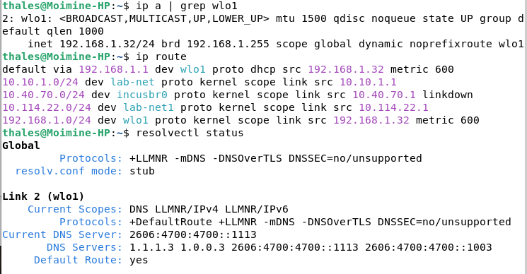

## Step 0.2 — Understanding Incus

**Goal:** get familiar with Incus's core concepts before creating any instance.

**Installation and initialization:**
```bash
apt install incus
incus admin init
```

Added my user to the `incus-admin` group, so I can manage Incus without using `sudo` every time.

**Concepts covered:**
- **Storage pool vs storage volume** : the pool is the total physical space available to all instances; a volume is the portion of that space dedicated to a specific instance.
- **Profile** : a reusable configuration template, applied to one or more instances to avoid repeating the same settings on every creation.
- **Project** : an isolation space, used to keep groups of instances, networks, and profiles separate within a single Incus host.
- **Built-in network stack** : Incus runs a `dnsmasq` service by default, acting as both DHCP and DNS server on every network it creates.
- **Hypervisor** : Incus VMs run on KVM, the Linux kernel's native hypervisor.

**Commands used to explore these concepts:**
```bash
incus storage list
incus project list
incus network list
incus profile list
```

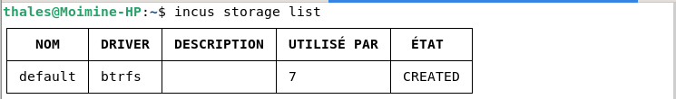

---

# Phase 1 — First virtual network

**Goal:** understand how machines communicate with each other.

## Step 1.1 — Create a network

```text
Name   : lab-net
Subnet : 10.10.1.0/24
```

## Step 1.2 — First container (`debian1`)

```bash
incus shell debian1
ip a
```

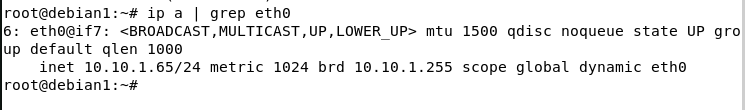

## Step 1.3 — Second container (`debian2`)

```bash
incus shell debian2
ip a
```

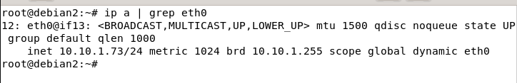

## Observations: DHCP, DNS, ARP, ICMP and NAT

### DHCP

- Exchange between the DHCP server (`dnsmasq`, built into Incus) and the machines on `lab-net`, for IP address assignment following the DORA cycle: Discover, Offer, Request, Acknowledge.
- The protocol uses two UDP ports:
  - port 67 (`bootps`): the **server** listens here (receives Discover and Request);
  - port 68 (`bootpc`): the **client** listens here (receives Offer and Acknowledge).

```bash
sudo tcpdump -i lab-net port 67 or port 68 -vvv
```

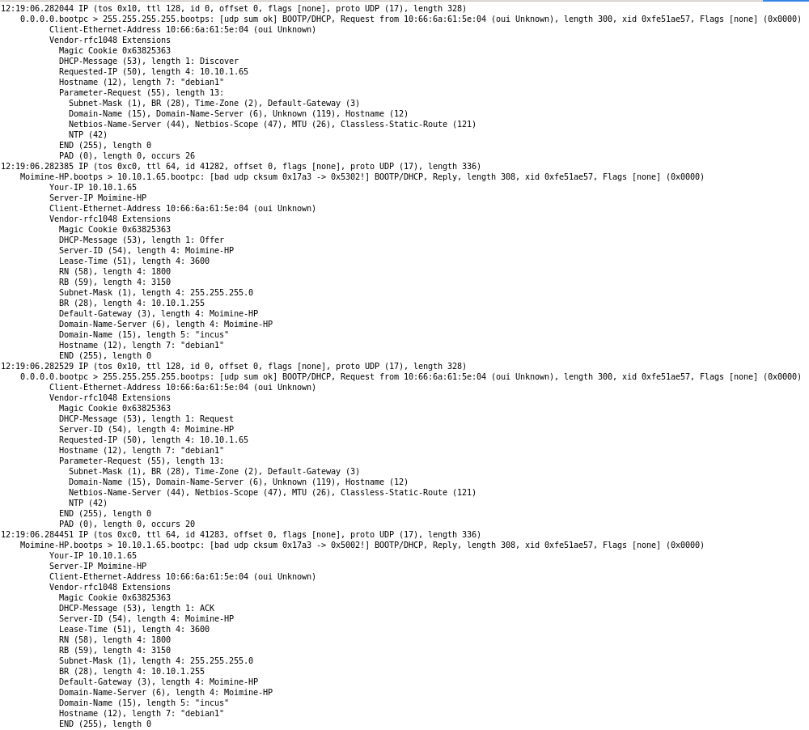

### DNS

- Name resolution, required to reach the internet.
- Distinction between the local resolver (the `systemd-resolved` stub) and authoritative/recursive DNS servers.
- The protocol uses port 53: UDP by default, TCP for larger responses and zone transfers.

```bash
nslookup google.com
host google.com
dig google.com
```

### ARP

- Capturing ARP frames (`who-has` / `is-at`) between two test containers.
- Different behavior between `arping` and `ping` regarding the kernel's neighbor cache: `arping` stays strictly at layer 2 and doesn't update the neighbor cache, while `ping` triggers a normal ARP resolution and creates a `REACHABLE` entry.

```bash
incus exec debian1 -- arping -c 2 debian2
incus exec debian1 -- ip neigh show
```

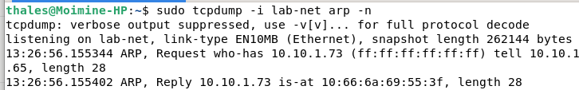

After these exchanges, each machine caches its peer's MAC address:

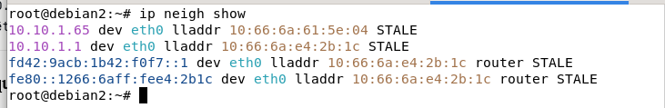

### ICMP

- ICMP Echo Request / Echo Reply sequences.
- The `Destination Host Unreachable` case, generated locally when ARP resolution fails.
- How TTL works, and how `traceroute` makes use of it.

```bash
incus exec debian1 -- ping debian2
```

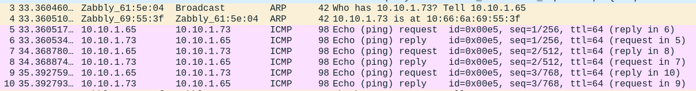

```bash
incus exec debian1 -- ip route
incus exec debian1 -- traceroute debian2
incus exec debian1 -- traceroute google.com
```

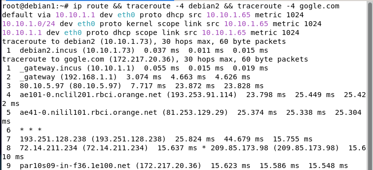

### NAT

- Address translation: containers (private IP `10.10.1.x`) reach the internet masked behind the host machine's IP (`192.168.1.32`).
- Verified by comparing two captures, before and after translation (bridge interface, then the host's outbound interface).

```bash
incus exec debian1 -- ping -c 2 8.8.8.8
```

On the host, before translation (the container's IP is visible):

```bash
sudo tcpdump -i lab-net icmp -n
```

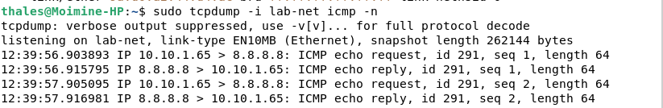

Then after translation (the host's IP is visible):

```bash
sudo tcpdump -i wlo1 icmp -n
```

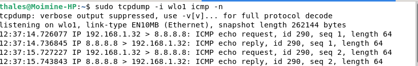

---

# Phase 2 — Network servers

**Goal:** set up DHCP and DNS so machines on the network can communicate without any manual configuration.

## Step 2.1 — Create a profile

```text
Name        : lab-limits
Description : baseline configuration shared by all containers/VMs used throughout the lab
```

This profile is shared across every instance in the lab: it's created in the `default` project and stays usable from other projects thanks to `features.profiles=false`.

```bash
incus profile create lab-limits
incus profile edit lab-limits < lab-limits.yaml
```

Config file: [`lab-limits.yaml`](configs/lab-limits.yaml)

## Step 2.2 — Create a project

```text
Name        : lab-srv
Description : groups the server machines (DHCP and DNS containers)
```

```bash
incus project create lab-srv --config features.profiles=false
incus project switch lab-srv
```

## Step 2.3 — Create a network

DHCP and DNS built into Incus are disabled on this network, so my own servers are the ones handling address assignment and name resolution.

```text
Name        : lab-net1
Description : lab network, 10.114.22.0/24, no built-in DHCP/DNS, domain homelab.local
```

```bash
incus network create lab-net1 ipv4.address=10.114.22.1/24 ipv4.nat=true ipv4.dhcp=false dns.mode=none dns.domain=lab.local
```

**Note:** the network lives in the `default` project and is shared with `lab-srv` (`features.networks=false`). Per-project network isolation in Incus requires OVN, which isn't needed here.

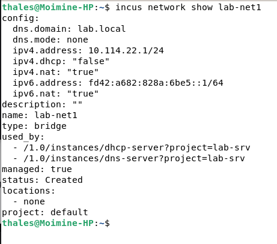

## Step 2.4 — DHCP server

```text
Machine  : dhcp-server
Software : Kea DHCP
```

```bash
incus launch images:debian/13 dhcp-server --profile default --profile lab-limits --network lab-net1
apt install kea-dhcp4-server
```

### Container network configuration

`dhcp-server` uses a static IP address (`10.114.22.2`), configured with `systemd-networkd` in `/etc/systemd/network/eth0.network`. For functional reasons, `dhcp-server` has no internet access (no gateway configured): its role is limited to answering DORA requests on the local network, which doesn't require any outbound connectivity.

Config file: [`eth0.network`](configs/eth0.network)

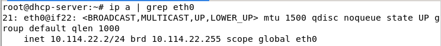

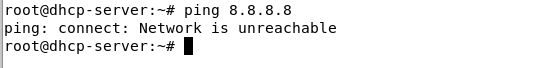

### Kea configuration (`/etc/kea/kea-dhcp4.conf`)

**Note on future changes:** the `routers` option currently points to `10.114.22.1` (the `lab-net1` Incus bridge), used temporarily as the gateway. It will be updated to the virtual router's address once Phase 3 is done.

### Validation

```bash
kea-dhcp4 -t /etc/kea/kea-dhcp4.conf
sudo systemctl restart kea-dhcp4-server
sudo systemctl status kea-dhcp4-server
```

Full config file: [kea-dhcp4.conf](configs/kea-dhcp4.conf)

**Tutorial used as a reference:** [Setting up a Kea DHCP server](https://www.it-connect.fr/linux-installer-et-configurer-un-serveur-dhcp-kea-sur-debian/)

---

## Step 2.5 — DNS server

```text
Machine  : dns-server
IP       : 10.114.22.3 (DHCP reservation by MAC address)
Software : bind9
Zone     : homelab.local
```

```bash
incus launch images:debian/13 dns-server --profile default --profile lab-limits --network lab-net1
apt install bind9 dnsutils
```

**DHCP result:** `dns-server` correctly receives its reserved address `10.114.22.3` from Kea, matching the configuration.

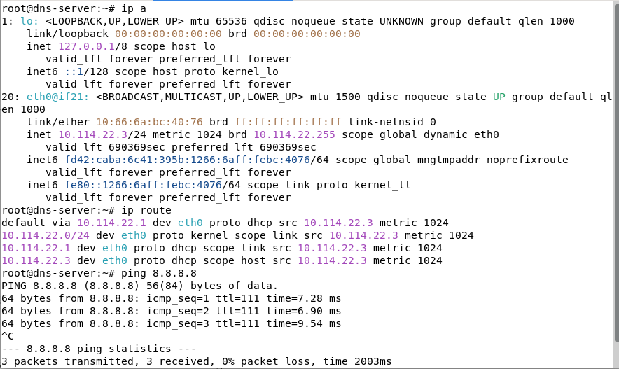

### Configuring bind9 (config files under `/etc/bind/`)

**First step:** configure bind9's general options in `/etc/bind/named.conf.options`.
Config used: [named.conf.options](configs/named.conf.options).

**Second step:** create and configure the forward and reverse DNS zones.

Zones are declared in `/etc/bind/named.conf.local`. This file tells bind9 which zones it's responsible for, and which zone files to use as the underlying database.

**Zone config file:** [named.conf.local](configs/named.conf.local).

Next, create and populate the zone files:
- Forward zone: name-to-IP records (e.g. `google.com` → `8.8.8.8`).
- Reverse zone: IP-to-name records (e.g. `8.8.8.8` → `google.com`).

- Forward zone file: [db.homelab.local](configs/db.homelab.local).
- Reverse zone file: [db.reverse.homelab.local](configs/db.reverse.homelab.local).

**Third step:** check the syntax of both zone files, then restart the BIND9 service:

```bash
named-checkzone homelab.local /etc/bind/db.homelab.local
named-checkzone 22.114.10.in-addr.arpa /etc/bind/db.reverse.homelab.local
sudo systemctl start bind9
sudo systemctl enable named.service
sudo systemctl status bind9
```

**Resolution test results with bind9:**

Resolution through the recursive resolver:

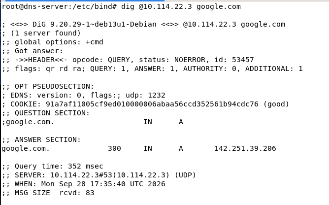

Local reverse resolution:

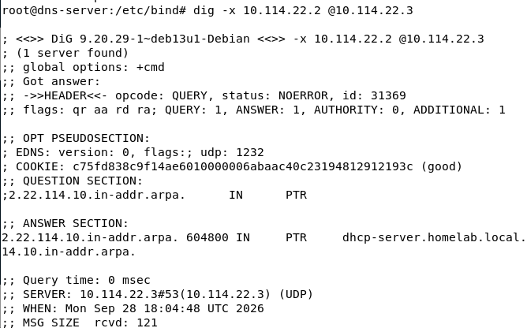

**Tutorial used as a reference:** [Setting up a DNS server with BIND9](https://www.it-connect.fr/dns-avec-bind-9/)

---

## Step 2.6 — DHCP and DNS together

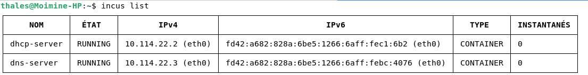

---

# Phase 3 — Routing

**Goal:** understand the role of a router.

## Step 3.1 — Linux router (nftables) — practice
## Step 3.2 — Two networks
## Step 3.3 — NAT
## Step 3.4 — pfSense — adopted router


---

# Phase 4 — Firewall

**Goal:** control traffic, not just route it.

## Step 4.1 — nftables rules — practice
## Step 4.2 — Observing with Wireshark
## Step 4.3 — DROP vs REJECT
## Step 4.4 — pfSense — adopted firewall
## Step 4.5 — Equivalent rules in pfSense
## Step 4.6 — DROP vs REJECT in pfSense

---

# Phase 5 — Active Directory

**Goal:** understand the most common enterprise network environment.

## Step 5.1 — Domain controller
## Step 5.2 — Client machine
## Step 5.3 — GPO
## Step 5.4 — Low-privilege user

---

# Phase 6 — Cyber Blue Team (detection)

**Goal:** be able to detect attacks before launching them myself.

## Step 6.1 — Wazuh
## Step 6.2 — Sysmon
## Step 6.3 — Suricata
## Step 6.4 — Suricata on Raspberry Pi

---

# Phase 7 — Cyber Red Team (attack)

**Goal:** generate real attack traffic.

## Step 7.1 — Reconnaissance
## Step 7.2 — Cross-checking
## Step 7.3 — Exploitation and report

---

# Phase 8 — Virtual network segmentation

**Goal:** build a real enterprise-style architecture, with a final addressing scheme.

## Planned addressing scheme

`10.114.22.0/24` split into four `/26` subnets (64 addresses each):

```text
ADMIN   : 10.114.22.0/26    (10.114.22.1   - 10.114.22.62)
USERS   : 10.114.22.64/26   (10.114.22.65  - 10.114.22.126)
SERVERS : 10.114.22.128/26  (10.114.22.129 - 10.114.22.190)
DMZ     : 10.114.22.192/26  (10.114.22.193 - 10.114.22.254)
```

---

# Phase 9 — Moving to real hardware

**Hardware:** managed switch, router, Raspberry Pi.

## Step 9.1 — VLANs on the real switch
## Step 9.2 — Trunk (802.1Q)
## Step 9.3 — Router-on-a-stick
## Step 9.4 — ACLs on the real switch/router
## Step 9.5(optionnal) — Secure remote access (VPN)

---

# Phase 10 — HID injection

## Step 10.1 — Arduino: HID injection (BadUSB)

---

